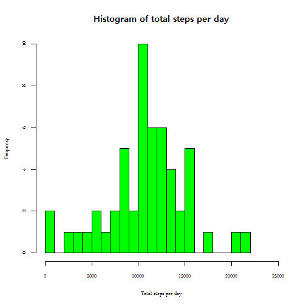
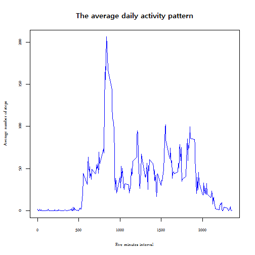
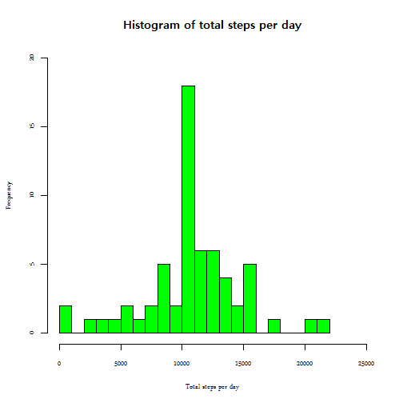
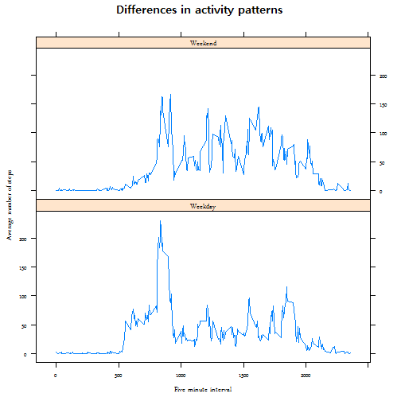

#"Reproducible Research: Peer Assessment 1"
===========================================
##Introduction
This assignment makes use of data from a personal activity monitoring device. This device collects data at 5 minute intervals through out the day. The data consists of two months of data from an anonymous individual collected during the months of October and November, 2012 and include the number of steps taken in 5 minute intervals each day.
Data.

The necessesary data can be download from [here](https://d396qusza40orc.cloudfront.net/repdata%2Fdata%2Factivity.zip)

Note: In order for the code to work the csv document `activity.csv` should be stored in the working directory, and `dplyr` and `lattice` packages installed in your machine.  
Also, to avoid language problems, the locale has been set to english.


```r
Sys.setlocale("LC_TIME", "English")
```

```
## [1] "English_United States.1252"
```

```r
library(dplyr)
library(lattice)
```

##Loading and preprocessing the data


```r
activity<-read.csv("activity.csv", na.strings = NA)
activity$date<-as.Date(activity$date)
```
##What is mean total number of steps taken per day?

Calculate the total number of steps taken per day, ignoring missing values.

```r
total_steps<-group_by(activity,date)%>%na.omit(total_steps)%>%summarise(total=sum(steps))
```
Plot a histogram of the total number of steps taken each day.

```r
hist(total_steps$total, col="green", breaks=25, 
     xlab = "Total steps per day", 
     main = "Histogram of total steps per day",     
     xlim=c(0, 25000))
```

 

Calculate and report the mean and median of the total number of steps taken per day

```r
mean(total_steps$total)
```

```
## [1] 10766.19
```

```r
median(total_steps$total)
```

```
## [1] 10765
```

##What is the average daily activity pattern?

Calculate the average number of steps taken in each five minutes interval across all days.


```r
daily<-group_by(activity, interval)%>%na.omit(daily)%>%summarise(average=mean(steps))
```

Time series plot of the 5-minute interval (x-axis) and the average number of steps taken, averaged across all days (y-axis).


```r
plot(x=daily$interval, y=daily$average, type = "l", col="blue",
     main="The average daily activity pattern",
     xlab="Five minutes interval",
     ylab="Average number of steps")
```

 

Which 5-minute interval, on average across all the days in the dataset, contains the maximum number of steps?

```r
max_steps<-which.max(daily$average)
interval_max<-daily$interval[max_steps]
```
The interval with the maximun average is 835

##Imputing missing values

Calculate and report the total number of missing values in the dataset.

```r
number_na<-sum(is.na(activity))
```
Number of missing values: 2304.

Fill the missing values with the average of that interval and create a new dataset.

```r
subset_activity<-na.exclude(activity)
activity_na<-subset(activity, is.na(activity$steps))
no_na<-merge(activity_na, daily)
no_na[,2]<-no_na[,4]
no_na<-no_na[,-4]
new_data<-rbind(no_na, subset_activity)
```

Make a histogram of the total number of steps taken each day.

```r
no_na_steps<-group_by(new_data, date)%>%summarise(total=sum(steps))
```

Plot a histogram of the total number of steps taken each day.

```r
hist(no_na_steps$total, col="green", breaks=25, xlab = "Total steps per day", 
     main = "Histogram of total steps per day",     
     xlim=c(0, 25000), ylim=c(0, 20))
```

 

Calculate and report the mean and median of the total number of steps taken per day

```r
mean(no_na_steps$total)
```

```
## [1] 10766.19
```

```r
median(no_na_steps$total)
```

```
## [1] 10766.19
```

We can see that now the median and mean are exactly the same value, and the graphic is slightly different from the first one. In our case, imputing the missing values did not have a great effect on the results.  
If we had set the missing values to zero in the fist point instead of omitting them, we would have seen greater differencies.

##Are there differences in activity patterns between weekdays and weekends?

Create a new factor variable in the dataset with two levels – “weekday” and “weekend” indicating whether a given date is a weekday or weekend day.

```r
new_data$days<-weekdays(as.Date(as.character(new_data$date)))
d <- new_data$days == "Saturday" | new_data$days == "Sunday"
new_data$days[d]= "Weekend"
new_data$days[!d]= "Weekday"
```
Panel plot containing a time series plot of the 5-minute interval (x-axis) and the average number of steps taken, averaged across all weekday days or weekend days (y-axis).

```r
final<-group_by(new_data, interval, days)%>%summarise(steps=mean(steps))

xyplot(steps ~ interval | days, data = final,
       type = "l", layout = c(1, 2),
       main=list(label="Differences in activity patterns"),
       xlab=list(label="Five minute interval"),
       ylab=list(label="Average number of steps"))
```

 


